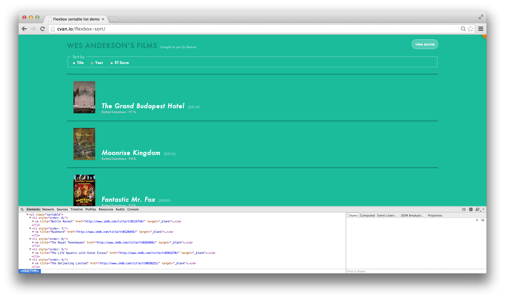

Most sites that use search allow you to sort by a particular criterion such as price or year. When you sort by a particular criterion, most sites either synchronously load a new page or update the DOM right then and there.

With the former approach, you are wasting time and bandwidth: at least one request has to be made for the HTML document, not to mention all the other resources requested on that page. You can do better by becoming a true single-paged app, so that you only request new content as needed.

With the latter approach, you can request from the server an HTML fragment or ideally JSON (which is used to render a template using JS) to replace the HTML of the results area. This isn’t a terrible method, but DOM manipulations are expensive. You could take a less naïve approach and keep in memory the DOM of each element and change only those elements that you need to. [Facebook’s React](http://facebook.github.io/react/) is a framework that keeps in memory a virtual DOM and does a difference of the HTML before and after to make only the absolutely necessary DOM manipulations.

Instead of physically rearranging existing DOM nodes, or destroying existing nodes and re-rendering new ones, we can reorder the search results using just one CSS property: flexbox’s [`order`](https://developer.mozilla.org/en-US/docs/Web/CSS/order).

And there you have it! Flexsort: the ability to render sorted data without having to reconstitute the DOM.

## Demo

This is a basic, no-frills example of sorting ordered data using flexsort.

[<big>__Try out the demo.__</big>  ](https://cvan.io/flexbox-sort/)

## Getting fancy

It’s you’re feeling up for it, try these at home:

* Allow a user to reverse the sort order.
* Instead of just basic ordering, allow results to also be filtered by simply hiding and showing the elements as needed (using the CSS property `display`).
* Implement flexsort on a massive table, allowing the rows to be sorted by clicking on a column.
* For improved navigation, hijack the browser history using the History API (i.e., `pushState`) to include a querystring in the URL (e.g., `?sort=year`).
* Handle pagination (for the bravest of the brave).

## Caveats

If you’re dealing with big data (tens of thousands of rows), be careful about keeping too much HTML on a single page.

If you copy the entire document to your clipboard, you’ll notice that the pasted text appears in the order in which the text is represented in the DOM, not in the visual order set by flexbox.

You can still select the text content of each flexbox-ordered item — just not text that overlaps to another flexbox-ordered item.

If you print the document, the visual order set by flexbox order is preserved. But why are you printing this? And why do you still own a printer?
